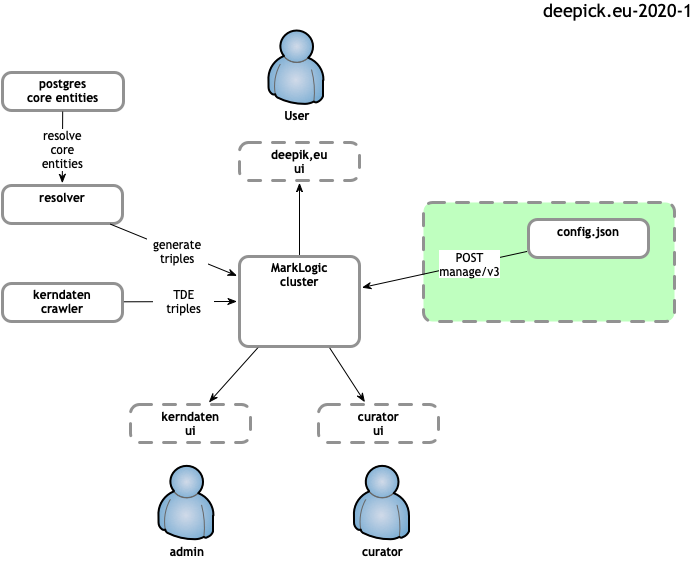

# deepick.eu-2020-1

git repo: https://gitlab.com/deepick/deepick-2020-1

A configuration payload for bootstrapping deepick.eu MarkLogic environment.

The work as defined:
* [MarkLogic configuration payload](etc/config.json) for bootstrapping deepick.eu config
* [integration tests](tests/test_integration.py) for bootstrapping deepick.eu config
* [curl](src/curl_integration_example.sh) and [python](src/python_integration_example.py) integration examples demonstrating applying MarkLogic configuration
* [create trigger configuration payload](etc/trigger.json)
* [curl example](src/curl_create_trigger_example.sh) of creating a trigger
* [curl example](src/curl_dynamic_example.sh) using dynamic values
* document with this [README.md](README.md)

Applicable scope of this work highlighted in the following diagram:


 
### constraints
* MarkLogic v10
* not a general replacement for [deepick/marklogic-admin](https://github.com/deepick/marklogic-admin)

## Example of Applying configuration(s)

The `src` directory contains integration examples.

Both configuration examples POST [etc/config.json](etc/config.json) to `manage/v3` endpoint.

### using curl
example of applying the configuration using curl 
```
curl --anyauth --user admin:admin         \
      -H "Content-type: application/json" \
      -d@../etc/config.json          \
      http://localhost:8002/manage/v3
```
just run: 
```
>./curl_integration_example.sh 
```

### using python
example of applying the configuration using python
```
import json
import requests
from requests.auth import HTTPDigestAuth

with open("../etc/config.json", "r") as json_file:
    data = json.load(json_file)

creds = ["admin", "admin"]
response = requests.post(
    "http://localhost:8002/manage/v3",
    data=json.dumps(data),
    headers={"Accept": "application/json", "content-type":"application/json"},
    auth=HTTPDigestAuth(creds[0], creds[1]),
)
print(str(response.status_code))

```
just run 
```
>python3 ./python_integration_example.sh 
```

## Example of creating a trigger

There are quasi management operations beyond bootstrapping in MarkLogic ... usually involving insertion of configuration 
data into a databases. Triggers are an example of such an operation, enabling a different set of users to perform CRUD operations 
seperate from sysadmin type operations.

The [src/curl_create_trigger_example.sh](src/curl_create_trigger_example.sh) script POSTS the following payload to `manage/v2` endpoint
```
{
	"name": "only-one-crawler",
	"description": "my trigger",
	"event": {
		"data-event": {
			"collection-scope": {
				"uri": "/crawl-run"
			},
			"document-content": {
				"update-kind": "create"
			},
			"when": "pre-commit"
		}
	},
	"module": "only-one-crawler.xqy",
	"module-db": "Modules",
	"module-root": "/modules/",
	"enabled": true,
	"recursive": true,
	"task-priority": "normal"
}
```
to create a trigger just run 
```
>./curl_create_trigger_example.sh
```

## Example of supplying a dynamic value 

CMA configuration may contain `%%token%%` which are transcluded allowing for values to be set at runtime. 
Values for these tokens can be supplied either by:

* seperate `params` object 
* params url var

The [src/curl_dynamic_example.sh](src/curl_dynamic_example.sh) script POSTs the following payload to `manage/v3` endpoint
```
{
	"params": {"password": "test"},
	"config": [{
		"user": [{
			"user-name": "example-user",
			"password": "%%password%%"
		}]
	}]
}
```
to create a user with a dynamically supplied password just run 
```
>./curl_dynamic_example.sh
```

## Dev & Test
### Running tests
The set of simple tests applies configuration(s) using curl and verifies using python requests.

#### docker
The entire dev environment is encapsulated in a [docker-compose.yml](docker-compose.yml) definition. To use docker dev
environment one needs to ensure you can pull down official MarkLogic docker images from docker hub. 

1) goto [https://hub.docker.com/_/marklogic](https://hub.docker.com/_/marklogic) and enable access to MarkLogic images.
2) ensure local docker is logged into the account you access docker hub in previous step.
```
>docker login
```

running the `docker-all` target should pull required images, setup everything and run
tests.
```
> make docker-all
```

#### locally
You are free to run locally (without docker) by setting up required deps: 

1) installs required [dependencies](#Dependencies) 
2) install and setup your own MarkLogic cluster and uncomment in Makefile
the export for `TEST_MARKLOGIC_HOST` (supplying relevant MarkLogic host)

```
export TEST_MARKLOGIC_HOST=localhost
```

to run locally just execute the Makefile `all` target
```
>make all
```

## Dependencies
The docker env has all deps installed but if one wants to run the
local targets then minimally the following is required

1) installation of MarkLogic v10 needs to installed and be available
2) python3 
3) some additional deps as follows

```
>apt-get install curl
>pip install pytest black pylint requests 
```
